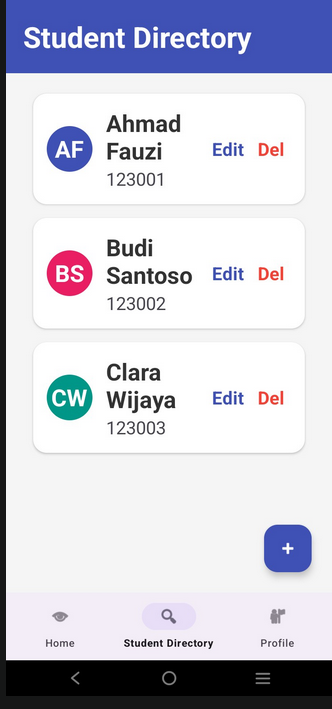
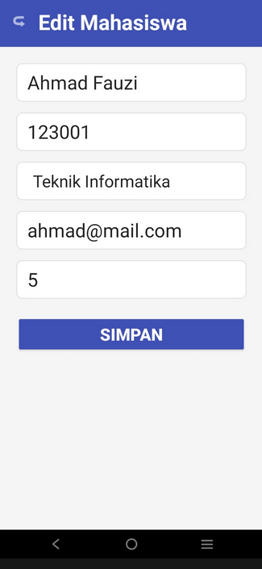
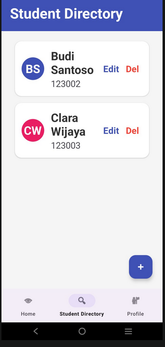
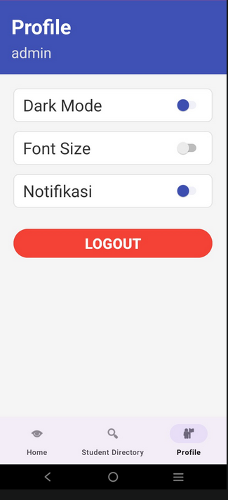
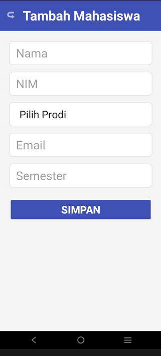

# T4-mobile
Nama: [Salsa Reike Maharani]
NIM: [F1D02310136]

Deskripsi Aplikasi
Aplikasi Student Contact App merupakan aplikasi berbasis Android yang digunakan untuk menyimpan dan mengelola data kontak mahasiswa. Pengguna dapat menambahkan, melihat, mengedit, dan menghapus data mahasiswa dengan mudah melalui tampilan yang sederhana dan user-friendly.

Halaman Login

  

---

Halaman Daftar Siswa

  

---

Halaman Catatan Siswa

  

---

Student Directory

  

---

Halaman Edit Data informatika

  

---

Perubahan Data jadi sistem informasi

  

---

Hapus Data

  

---

Data Berhasil Dihapus

  

---

Halaman Profile

  

---

Tambah Siswa

  

---

Data Berhasil Ditambahkan

  

Metode Penyimpanan, Aplikasi ini menggunakan SQLite Database sebagai metode penyimpanan data.
Alasan menggunakan SQLite:
Tidak membutuhkan koneksi internet
Ringan dan cocok untuk aplikasi mobile
Mudah diimplementasikan di Android Studio
Data tersimpan secara lokal di perangkat

Kendala:
Error saat menampilkan data di RecyclerView
Kesulitan dalam menghubungkan database dengan UI
Solusi:
Memperbaiki adapter dan memastikan data binding benar
Menggunakan Logcat untuk debugging error